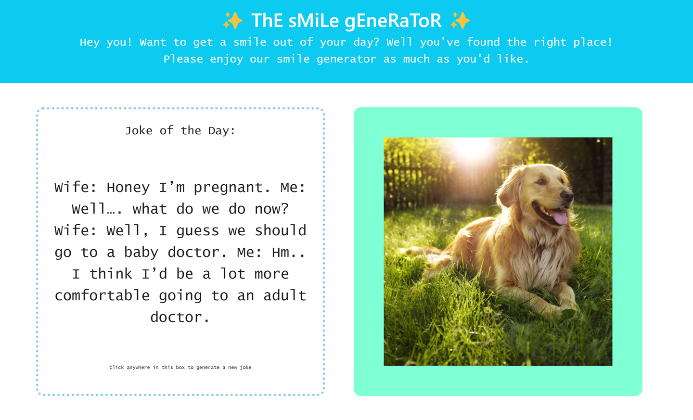
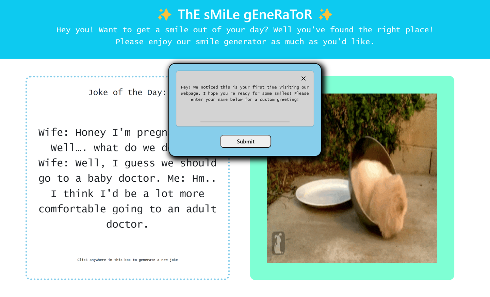
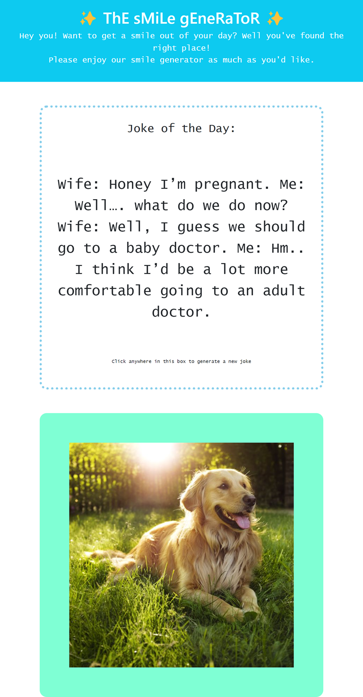

# Smile Generator

## Overview
   * As a user, you will have the ability to view random jokes and pictures. Once on the website, you will be presented with a random joke and photo. The user interface is designed so that simply clicking on a joke or a photo will randomly generate a new one.

## Features

1. Responsive Design

   * Our group designed this webpage to be fully responsive from the smallest mobile devices, to tablets, to the largest desktops to provide a consistent means to view the Smile-Generator in an enjoyable and engaging experience.

2. Dad Joke API

    * On the left side of the web application, the user can view a container with a single dad joke. Upon clicking on the container, a new joke populates.

3. Dog Photo API

    * On the right side of the web application, the user can view a container with a single dog photo. A new dog photo populates for every click the user makes onto the dog image.

4. Modal Greeting

    * For every new user to visit the web application, a greeting is presented inside a modal with a form input to get the user's name, which is to be displayed in the header.

5. Dynamic Personalized Header

    * A personalized header is presented at the top of the page to give the user a warm welcome. It uses client-side storage to form the greeting, which is able to tell whether the user has visited the site before.

6. Technologies Used

    * HTML5
    * CSS
    * JavaScript
    * Bootstrap
    * Google Fonts
    * VSCode
    * GitBash

## Usage
To view this webpage, please visit https://joshmassa.github.io/smile-generator/

To view this projects repository, please visit https://github.com/JoshMassa/smile-generator

When viewed from a desktop, the webpage should resemble the following image:

When viewed from a tablet, the webpage should resemble the following image:

When viewed from a mobile device, the webpage should resemble the following image:

## Credits

This project brought to you in part by UCLA Extension and its staff including but not limited to: Our class instructor and teaching assistant of UCLA Extension Coding Bootcamp 2023-2024.

Links to resource references used as follows:

Bootstrap: https://getbootstrap.com/docs/5.3/getting-started/introduction/

Dog API: https://icanhazdadjoke.com/api

Dad Joke API: https://developers.thecatapi.com/view-account/ylX4blBYT9FaoVd6OhvR?report=bOoHBz-8t

## License
This project does not contain a license.

